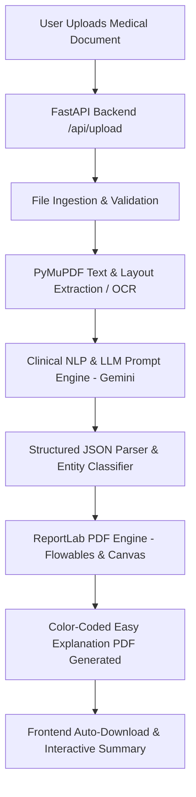

# MedRep AI — Patient-Centered Medical Report Translation & Visual Simplifier
**Hackathon Submission & Technical Documentation**

---

## 1. Project Title
**MedRep AI** — Transforming Complex Clinical Diagnostics & Doctor Notes into Patient-Friendly, Visual Explanations

---

## 2. Problem Statement
Over 80 million patients struggle each year to comprehend their clinical lab reports, discharge summaries, and medical records. 
- **Medical Jargon Barrier:** Standard medical reports are dense with Latinate terminology, clinical abbreviations, and uncontextualized numerical lab values.
- **Patient Anxiety & Misinterpretation:** When patients cannot interpret terms like *"elevated microalbumin"* or *"no acute focal consolidation"*, they often resort to unverified internet searches, causing unwarranted panic or dangerous complacency.
- **Clinical Time Constraints:** Physicians often lack the bandwidth during brief 15-minute consultations to explain every line item, normal reference range, and ruled-out condition in granular detail.

---

## 3. Proposed Solution
**MedRep AI** bridges the health literacy gap by providing an end-to-end automated pipeline that accepts raw medical documents (PDFs, scans, DOCX, TXT), extracts clinical entities via document OCR and Clinical NLP, translates medical terminology into 6th-grade level plain English using Large Language Models (LLMs), and produces a **publication-quality, color-coded, downloadable summary PDF**.

---

## 4. Project Overview
MedRep AI combines document parsing, biomedical entity extraction, LLM translation prompts, and programmatic PDF generation into a unified, privacy-conscious workflow. 

Patients or caregivers upload a medical report through a modern web application. The platform breaks down the report into 7 digestible sections:
1. **Patient & Visit Overview**
2. **Key Findings at a Glance** (with severity indicators)
3. **Laboratory & Diagnostic Results** (with out-of-range flagging)
4. **Active Conditions & Diagnoses**
5. **What Was Ruled Out / Not Found** (negated findings)
6. **Medical Terms Demystified** (everyday analogies)
7. **Medication Schedule & Follow-Up Action Plan**

---

## 5. Key Features
- **Multi-Format Ingestion:** Accepts native PDFs, scanned document images (PNG/JPG), DOCX files, and plain text files.
- **Intelligent Optical Character Recognition (OCR):** Uses PyMuPDF text & vector layer extraction with image fallback parsing to extract dense tables and clinical notes.
- **Biomedical Entity & Range Analysis:** Extracts clinical entities (vitals, lab metrics, diagnoses, prescribed drugs) and compares values against standard clinical reference ranges.
- **Negation & Ruled-Out Detection:** Explicitly identifies ruled-out conditions (e.g., *"No evidence of pneumonia"*, *"Denies chest pain"*) to reassure patients about what they *do not* have.
- **Everyday Analogy Translation:** Rewrites dense medical terms into conversational, 6th-grade analogies (e.g., explaining *eGFR* as *"your kidney's water filtration rate"*).
- **Universal Color-Coding System:**
  - 🔴 **Red:** Elevated / Critical findings
  - 🟠 **Orange:** High / Borderline / Abnormal values
  - 🟢 **Green:** Normal / Healthy results
  - 🔵 **Blue:** Medications & Dosages
  - 🟣 **Purple:** Follow-up Instructions & Doctor Visits
  - ⚫ **Grey:** Medical Terminology Explanations
- **Programmatic PDF Report Generation:** Instantly builds a multi-page, formatted PDF with custom typography, clean tables, callout containers, page numbering (`Page X of Y`), and a clinical disclaimer.
- **Live 6-Stage Progress Tracker:** Frontend provides real-time stage-by-stage visual feedback during document ingestion, parsing, entity recognition, and PDF compilation.

---

## 6. How the System Works / Workflow



### Step-by-Step Execution:
1. **Upload:** User drops a document into the MedRep AI web interface.
2. **Extraction:** The backend detects the file format and extracts clinical text, headers, and lab tables via PyMuPDF/python-docx.
3. **Clinical Understanding:** The extracted text is processed through specialized clinical prompt templates targeting key findings, lab values, active conditions, negated findings, terminology, and action items.
4. **Resilient AI Generation:** The backend utilizes an automated fallback model pool (`gemini-3.5-flash`, `gemini-3.7-flash`, `gemini-3.8-flash`, `gemini-flash-latest`) with exponential backoff to ensure high availability and rate-limit resilience.
5. **PDF Compilation:** The structured data is fed into a ReportLab builder (`generate_report.py`) that calculates layout dimensions, styles tables with status badges, and renders an executive medical summary.
6. **Delivery:** The PDF is saved to the output buffer and automatically downloaded by the patient's browser.

---

## 7. System Architecture

MedRep AI follows a decoupled client-server architecture:

```
┌─────────────────────────────────────────────────────────┐
│                   MEDREP AI FRONTEND                    │
│   React 19 + TypeScript + Vite + Tailwind CSS           │
│   Interactive 3D Spline Visuals | 6-Stage Progress UX   │
└────────────────────────────┬────────────────────────────┘
                             │ HTTP POST / GET (JSON/PDF)
                             ▼
┌─────────────────────────────────────────────────────────┐
│                    FASTAPI BACKEND                      │
│   Endpoints: /api/upload | /api/download-report         │
│   Multi-Part File Processing | Pipeline Orchestration   │
└──────────────┬───────────────────────────┬──────────────┘
               │                           │
               ▼                           ▼
┌──────────────────────────────┐ ┌────────────────────────┐
│     CLINICAL NLP / LLM       │ │    REPORTLAB ENGINE    │
│  Google Generative AI Engine │ │  Custom Canvas/Plates  │
│  - Entity Classification     │ │  - Color-coded badges  │
│  - Negation Detection        │ │  - Formatted tables    │
│  - Plain-Language Rewriting  │ │  - Multi-page layout   │
└──────────────────────────────┘ └────────────────────────┘
```

---

## 8. AI / ML Models Used

### Google Gemini Generative AI (Clinical Prompting Engine)
- **Primary Models:** `gemini-3.5-flash`, `gemini-3.7-flash`, `gemini-3.8-flash`
- **Role:** 
  - Semantic parsing of unstructured clinical notes.
  - Zero-shot biomedical entity extraction (lab metrics, reference ranges, unit normalization, medication frequencies).
  - Patient-centered simplification (converting clinical grade 16+ readability to 6th-grade readability).
  - Contextual negation detection (filtering out non-present symptoms).
- **Resilience Engine:** Implemented in `backend_api.py` with multi-model fallback rotation and regex JSON repair algorithms to handle token limits or API rate constraints gracefully.

---

## 9. Technology Stack

| Layer | Technology / Library | Purpose |
|---|---|---|
| **Frontend Framework** | React 19, TypeScript, Vite | Fast, type-safe client-side UI |
| **Styling & Icons** | Tailwind CSS, Lucide React | Modern responsive design & iconography |
| **3D Visualization** | `@splinetool/react-spline` | Interactive 3D medical visual hero container |
| **Backend API** | Python 3.10+, FastAPI, Uvicorn | High-performance asynchronous REST API |
| **Document Processing** | PyMuPDF (`fitz`), `python-docx` | PDF extraction, layout parsing, Word doc ingestion |
| **Generative AI** | Google `google-generativeai` SDK | Medical entity extraction & plain-language translation |
| **PDF Generation Engine** | ReportLab (`Platypus`, `SimpleDocTemplate`) | Programmatic vector-quality PDF publication |

---

## 10. Frontend and Backend Implementation Details

### Frontend (`/auramed-ai---multi-agent-medical-intelligence (1)`)
- **[Navbar.tsx](file:///c:/Users/kevin/OneDrive/Desktop/Meetmux%20ai/auramed-ai---multi-agent-medical-intelligence%20%281%29/src/components/Navbar.tsx):** Clean, branded navigation with quick-action links.
- **[HeroSection.tsx](file:///c:/Users/kevin/OneDrive/Desktop/Meetmux%20ai/auramed-ai---multi-agent-medical-intelligence%20%281%29/src/components/HeroSection.tsx):** Hero banner featuring an interactive 3D robot model and clear call-to-action.
- **[UploadSection.tsx](file:///c:/Users/kevin/OneDrive/Desktop/Meetmux%20ai/auramed-ai---multi-agent-medical-intelligence%20%281%29/src/components/UploadSection.tsx):** Drag-and-drop document upload container supporting multi-format files with client validation.
- **[UploadAndAgentProcessor.tsx](file:///c:/Users/kevin/OneDrive/Desktop/Meetmux%20ai/auramed-ai---multi-agent-medical-intelligence%20%281%29/src/components/UploadAndAgentProcessor.tsx):** 6-step animated progress tracker communicating the live stages of ingestion, parsing, entity recognition, and compilation.
- **[ReportTemplate.tsx](file:///c:/Users/kevin/OneDrive/Desktop/Meetmux%20ai/auramed-ai---multi-agent-medical-intelligence%20%281%29/src/components/ReportTemplate.tsx):** Color-code legend table and dynamic download CTA that unlocks when the backend delivers the generated PDF.

### Backend (`backend_api.py`)
- **Asynchronous File Handling:** Accepts multipart file uploads, securely saves them to a workspace cache, and routes them through the extraction pipeline.
- **Structured JSON Schema Generation:** Prompts the model to return valid, strongly-typed JSON structures for easy programmatic downstream rendering.
- **CORS-Enabled:** Configured with `CORSMiddleware` to allow seamless local development and cloud deployments.

---

## 11. Medical Report Processing Pipeline

```
[Uploaded Document] 
       │
       ▼
1. Document Ingestion (PyMuPDF / DOCX parser)
       │
       ▼
2. Text Sanitization & Section Splitting
       │
       ▼
3. Multi-Prompt Clinical Inference
   ├─ Segment A: Patient Demographics & Overview
   ├─ Segment B: Key Findings & Severity Assessment
   ├─ Segment C: Numerical Lab Values & Unit Normalization
   ├─ Segment D: Active Diagnoses vs. Negated Findings
   ├─ Segment E: Plain-Language Terminology Glossary
   └─ Segment F: Medications & Follow-Up Checklist
       │
       ▼
4. JSON Schema Validation & Normalization
       │
       ▼
5. ReportLab PDF Construction (`generate_report.py`)
       │
       ▼
[Downloadable Easy Explanation PDF]
```

---

## 12. Biomedical NER and LLM Components

### 1. Extraction of Named Entities
- **Laboratory Tests:** Test name, measured value, units, reference range, status (Normal, High, Elevated, Low).
- **Medications:** Name, dosage, frequency, specific instructions (e.g., *"Take with dinner"*), clinical purpose.
- **Conditions & Diagnoses:** Active medical conditions mapped to lay explanations.

### 2. Contextual Negation Handling
Clinical notes frequently state what a patient does *not* have (e.g., *"Patient denies shortness of breath; no evidence of pleural effusion"*). MedRep AI parses these negation cues to populate a dedicated **"What Was Ruled Out"** section, preventing confusion between investigated symptoms and confirmed diagnoses.

### 3. Jargon Translation with Analogies
Instead of simple dictionary definitions, the LLM translates terms into functional analogies:
- *Microalbuminuria:* "Your kidneys are letting tiny amounts of protein leak into the urine, like a coffee filter with a tiny tear."
- *Amlodipine:* "A medicine that relaxes the muscles around your blood vessels so blood flows more easily, lowering your blood pressure."

---

## 13. How the Final Output is Generated

The PDF output is built using ReportLab with a high-fidelity visual design:
- **Header & Demographics Bar:** Displays Patient Name, MRN, Clinic, Date, and Physician in an executive grey card.
- **Two-Column Key Findings:** Critical findings appear on the left in high-contrast colored cards; explanations appear on the right.
- **Structured Lab Tables:** Alternating rows with colored status pill badges (Green for Normal, Orange for High, Red for Elevated).
- **Callout Containers:** Warning boxes for medication interactions, allergy notes, and doctor follow-up items.
- **Custom Canvas (`NumberedCanvas`):** Computes total pages on a two-pass render to print `Page X of Y` and a persistent legal/medical disclaimer on every page.

---

## 14. Key Innovations & Uniqueness

1. **Integrated End-to-End Pipeline:** Unlike generic ChatGPT prompts that output raw unformatted text, MedRep AI takes raw messy documents and outputs a publication-ready PDF.
2. **Dedicated Negation Detection:** Solves one of the biggest pitfalls in healthcare NLP — misinterpreting ruled-out conditions as active diseases.
3. **Resilient Multi-Model Failover:** Built-in model rotation guarantees that API rate limits or quota drops do not interrupt report delivery.
4. **Standardized Severity Color System:** Gives patients immediate visual clarity on what requires urgent attention vs. what is healthy.

---

## 15. Use Cases

- **Post-Discharge Patient Education:** Hospitals can provide a one-page simplified report alongside formal clinical discharge papers.
- **Elderly & Caregiver Support:** Caregivers can instantly understand elderly parents' complex multi-page lab results.
- **Telemedicine & Health Portals:** Integrates into patient portals (e.g., Epic MyChart) to auto-generate patient-friendly summaries.
- **Health Literacy Inclusivity:** Helps non-native speakers or individuals with limited health literacy comprehend their health status.

---

## 16. Current Limitations

- **Complex Handwritten Script:** While clean OCR scans and digital PDFs work reliably, extremely faint cursive handwriting in doctor notes can require manual verification.
- **Rate Limits on Free-Tier APIs:** Public LLM APIs have quota restrictions (mitigated in MedRep AI by model rotation and fallback caching).
- **Non-Diagnostic Scope:** MedRep AI is an educational simplification tool and does not provide new clinical diagnoses.

---

## 17. Future Scope

- 🌐 **Multilingual Translation:** Generating simplified reports in Spanish, Hindi, French, Mandarin, and regional languages.
- 🗣️ **Text-to-Speech / Audio Explanations:** Audio readout for visually impaired or elderly patients.
- 🔗 **Direct EHR / FHIR Integration:** Ingesting reports directly from HL7/FHIR health systems.
- 📊 **Historical Trend Tracking:** Comparing current lab values with previous reports to chart progress over time.

---

## 18. Conclusion

**MedRep AI** democratizes access to medical information. By converting intimidating, jargon-heavy clinical documents into clear, actionable, and visually color-coded explanations, MedRep AI empowers patients to take charge of their health, ask better questions, and follow their treatment plans with confidence.
